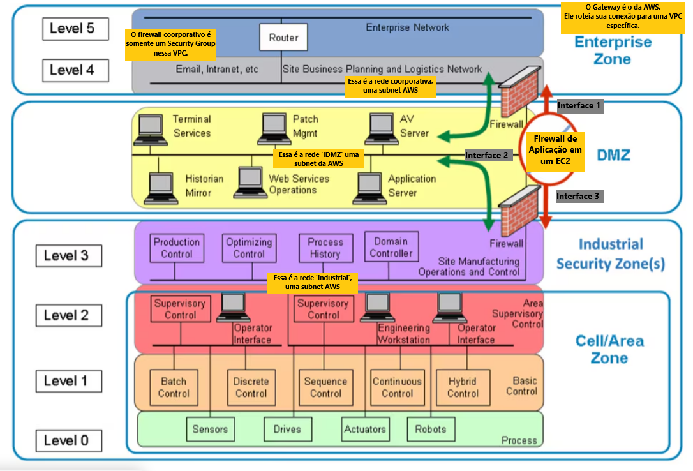

# Terraform para Criação de Ambiente na AWS

Este repositório contém um conjunto de scripts Terraform destinados a criar e configurar um ambiente na AWS.

O objetivo é facilitar o provisionamento de recursos na AWS através da AWS Academy para explorar as práticas de segurança digital

## Índice

- [Sobre o ambiente e a estrutura do projeto](#sobre-o-ambiente-e-a-estrutura-do-projeto)
- [Sobre como executar o projeto](#sobre-como-executar-o-projeto)
- [Sobre autenticação na AWS Academy](#sobre-autenticação-na-aws-academy)

## Sobre o ambiente e a estrutura do projeto

O objetivo é simular uma infraestrutura industrial segundo o modelo de purdue e utilizar ela para testar alguns conceitos de segurança digital.

| Componente                           | Descrição                                                                                                                                                           |
|--------------------------------------|---------------------------------------------------------------------------------------------------------------------------------------------------------------------|
| **Rede Industrial (Cell Area Zone)** | Rede onde operam os sistemas industriais, isolada para proteger sistemas críticos.                                                                                  |
| **Rede IDMZ (DMZ da TO)**            | Rede intermediária que contém serviços acessíveis a partir da rede coorporativa, mas com segurança adicional antes de permitir acesso à rede interna.               |
| **Rede Corporativa**                 | Controlada pelo Security Group, oferece acesso à interface externa do Firewall TO para acesso SSH e outros serviços corporativos.                                   |
| **Máquinas Diversas**                | Instâncias EC2 de diversos tipos que podem ser distribuídas nas três redes (Cell Area Zone, IDMZ da TO, e Rede Corporativa), herdando as respectivas configurações. |
| **Firewalls**                        | Dois firewalls: um simulado por uma instância EC2 (Firewall TO) e outro como Security Group (Firewall Corporativo). O Firewall TO possui duas interfaces.           |

   <div align="center">  </div>

## Sobre como executar o projeto

Eu recomendo fortemente que você acesse o console da AWS e vá observando a criação e instancia desses diversos componentes, na ordem que estou falando.

Mas, se você quiser, pode simplesmente executar todo o projeto e toda a infraestrutura irá subir de uma vez.

> **Nota 1º** — Ao executar os terraforms individualmente, você guardará o estado individual desses recursos e passará a ser obrigado a gerenciar o estado deles individualmente.
> **Nota 2º** — Infelizmente, não é possível automatizar a criação das chaves `.pem` via terraform, porque uma vez que elas são criadas desta forma você não conseguirá baixa-las, daí não conseguirá utiliza-las. A única coisa que precisará criar manualmente, caso queira acessar a máquina em questão.

Os dois principais recursos (serviços) da AWS envolvidos aqui são:

- `EC2` → Elastic Compute Cloud, usado para abrigar recursos e subserviços **relacionados à máquinas**;
- `VPC` → Virtual Private Cloud, usado para abrigar recursos e subserviços **relacionados à infraestrutura de rede**;

Precisamos de somente uma VPC para abrigar todos os recursos que iremos criar. Nativamente, você já possui uma VPC, pois a única forma de 'existir' na AWS é tendo uma 'rede privada' dentro dela. Sua VPC terá obrigatóriamente — não consiguirá excluir e alterar:

- 1 Gateway
- 1 Route Table
- 1 DHCP
- 1 Security Group
- 1 ACL (Access Control List)

É importante entender que sem esses recursos, todos sob uma mesma VPC, são fundamentais para instanciar uma máquina EC2, pois do contrário não há como acessa-la. Com efeito, conforme você vai instanciando máquinas no EC2, desatentamente, pode criar vários recursos desses — principalmente security groups — o que acaba por poluir e, a depender do recurso, encecarecer seu ambiente.

### Crie suas subnets

A primeira coisa que você pode testar é a criação das subnets em `.\rede`. Ao estar na raiz do projeto, executando o comando `terraform apply`.

## Sobre autenticação na AWS Academy

Para acessar a AWS remotamente utilizando as credenciais fornecidas pela AWS Academy, siga os passos abaixo:

1. **Obtenha suas credenciais**: A AWS Academy fornece temporariamente um par de chaves de acesso (Access Key ID e Secret Access Key) e, ocasionalmente, um Session Token. Estas credenciais permitem que você se autentique e acesse os recursos AWS remotamente.

   <div align="center"></div>

2. **Configuração rápida**: Dentro do repositório, há um script em `aws_setup\aws.py` que facilita a configuração do ambiente AWS. Este script:

   - Verifica se o AWS CLI está instalado no seu sistema. Se não estiver, ele instala automaticamente.
   - Configura as suas credenciais da AWS utilizando as chaves de acesso que você forneceu.

   Para executar o script, utilize o seguinte comando no terminal:

```bash
python aws_setup/aws.py
```

> **Nota 3º** — pode ser `python3` ...ou pode ser que você nem tenha python instalado =)
